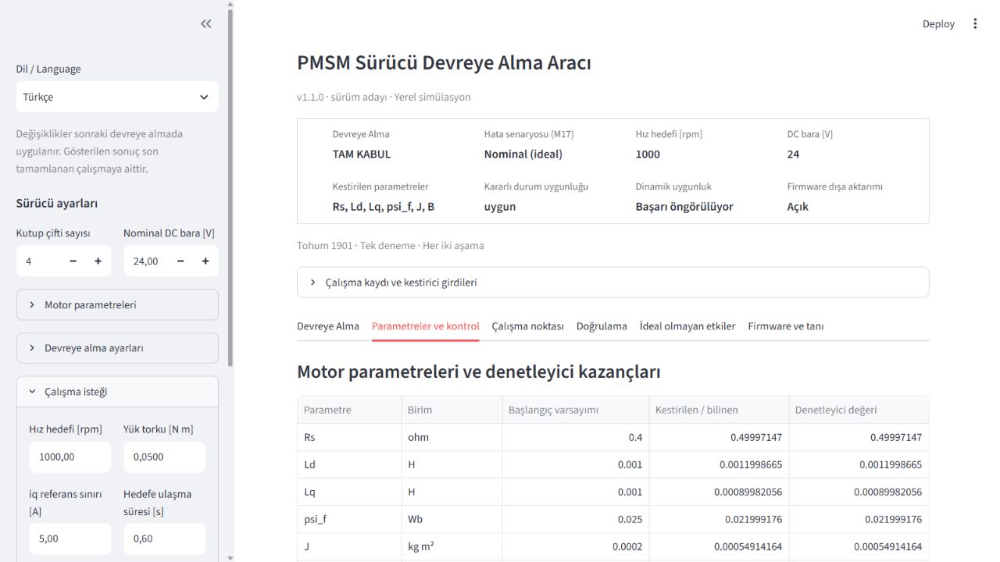
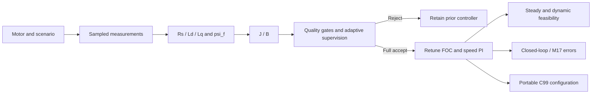

[Türkçe](README.md) | [**English**](README.en.md)

# Self-Commissioning PMSM Drive

## PMSM drive commissioning and parameter identification

A local tool for identifying `Rs, Ld, Lq, psi_f, J, B` from simulated voltage,
current and speed measurements. Accepted commissioning retunes the current and
speed PI controllers, then checks the operating point and closed-loop response.
Rejection retains the prior controller parameters and blocks firmware export.

The v1.0 backend is stable. v1.1.0 is an **unreleased candidate** for the
Turkish/English UI and Windows distribution.



## Run the application

### 1 — Windows package

Target Windows x64 file:
**`PMSM-Engineering-App-v1.1.0-Windows-x64.zip`**.

1. Download the ZIP and `SHA256SUMS.txt` from a successful
   [Windows workflow run](https://github.com/terogra/self-commissioning-pmsm-drive/actions/workflows/windows-portable.yml).
   During review these are workflow artifacts; a GitHub account may be required.
   After publication they will be on the [Releases page](https://github.com/terogra/self-commissioning-pmsm-drive/releases).
2. Extract the **entire ZIP** and retain its `_internal` folder.
3. Double-click **`PMSM Engineering App.exe`**. The local application opens in
   your browser. No Python, pip or Git is needed.
4. Stop with **Ctrl+C** in the console. Closing only the browser tab leaves the server running.

**The EXE is unsigned.** Windows SmartScreen may warn. SHA-256 checks integrity,
not signing or safety. If you prefer not to run an unsigned binary, use the
source path below. The EXE is optional.
[Windows startup and troubleshooting](packaging/README_WINDOWS_EN.md).

### 2 — Source code

With Python **3.11 or 3.12**, in Windows PowerShell:

```powershell
git clone https://github.com/terogra/self-commissioning-pmsm-drive.git
cd self-commissioning-pmsm-drive
python -m venv .venv
.\.venv\Scripts\Activate.ps1
python -m pip install -r requirements.txt
python -m app
```

If activation is blocked, use `.\.venv\Scripts\python.exe -m pip install -r requirements.txt`
and `.\.venv\Scripts\python.exe -m app` without activating.
On Linux/macOS use `source .venv/bin/activate` instead.
Downloading the source ZIP also works without Git.

Turkish is the default; select English using **Dil / Language** in the sidebar.
Language changes do not modify parameters or computed results.
**Run Commissioning** performs a new computation; tab/language changes do not.
The server binds only to the local `127.0.0.1` address.

## Commissioning workflow



Inspect stage estimates, measured/fitted plots, residual/sensitivity diagnostics,
rejection reasons, retry history, controller gains and current/voltage limits.
Simulation ground truth is separate under **Validation**;
estimators and quality gates do not receive it. Diagnostic codes and JSON keys
remain stable in both languages for reproducibility.

## Validation

- dq PMSM, Clarke/Park, current FOC and cascaded speed PI; DC-bus saturation and anti-windup.
- `Rs, Ld, Lq, psi_f, J, B` from measurements; measured-data gates and bounded adaptive attempts.
- Separate development/evaluation populations, retained failed/biased cases, and M17 sensing/inverter/delay/bus/resistance error models.
- Stable v1.0: **265 tests**, **43 native C assertions**, **31,484 Python/C samples**. All **16 saturation-boundary differences** remain in the evidence.
- v1.1 CI checks Python 3.11/3.12, GCC/Clang, headless application, language switching and actual packaged EXE HTTP 200; extracted ZIP is retested and SHA-256 generated.

[Validation details](docs/v1_validation.md) · [v1.1 productization](docs/v1_1_productization.md) ·
[Architecture](docs/architecture.md) · [Engineering journal](docs/engineering_log.md).
[UI terminology](docs/terminology.md).

Browser-free real demonstration:

```sh
python -m experiments.v1_demo --output demo-current
python -m pytest -q
```

This computes accepted and explicitly rejected cases. Committed v1.0 evidence
is not relabeled or overwritten; current-run version provenance is separate.
[v1.0 technical reference and advanced commands](README.v1.0.md).

## Assumptions and boundaries

This is a **simulation study**. Known pole pairs and known zero external load
during mechanical commissioning are explicit. Unknown load, Coulomb/static
friction, attached inertia and sensor bias limit applicability. Good tracking
alone does not prove accurate commissioning. Quality acceptance does not
establish feasibility of every operating request.

The quasi-steady timing estimate is **not a physical minimum or universal lower bound**;
the **full dq transient simulation** can enter the band earlier.

C99 configuration is **firmware-ready**, not deployed MCU firmware. No STM32
deployment, target timing, hardware validation, MISRA compliance or physical
safety guarantee is claimed. The Windows package is local and unsigned.

## License and version

Source code is [MIT licensed](LICENSE); dependencies retain their own licenses.
[Changelog](CHANGELOG.md) · [v1.1 candidate notes](RELEASE_NOTES_v1.1.0.md).
