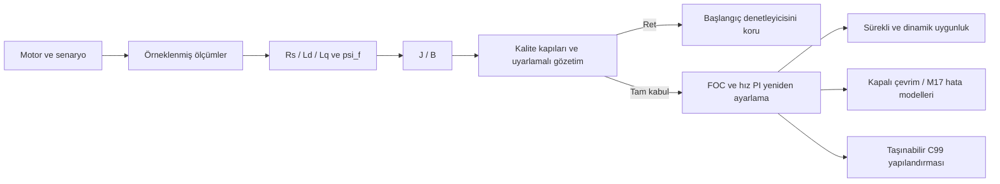

[**Türkçe**](README.md) | [English](README.en.md)

# Self-Commissioning PMSM Drive

## PMSM Otomatik Devreye Alma ve Sürücü Mühendislik Platformu

Bir PMSM sürücüsünü **ölçümden denetleyiciye kadar** inceleyen yerel mühendislik
uygulaması. Benzetilen gerilim, akım ve hız örneklerinden motorun altı elektriksel
ve mekanik parametresini kestirir; kaliteyi değerlendirir, uygun olduğunda PI
denetleyicileri yeniden ayarlar ve sürücünün çalışma koşullarını doğrular.

Amaç, otomatik devreye almanın başarılı örnekleriyle birlikte zayıf uyartım,
ölçüm yanlılığı ve gerilim sınırı altında nerede başarısız olduğunu göstermektir.
Reddedilen sonuçlar görünür kalır; başlangıç denetleyicisi korunur ve firmware
dışa aktarımı engellenir.

**v1.0 mühendislik altyapısı kararlı. v1.1.0, Türkçe/English arayüz ve Windows
taşınabilir dağıtım için sürüm adayıdır; henüz yayımlanmamıştır.**

## Uygulamayı deneyin — iki eşit seçenek

### A — Hazır Windows sürümü

Windows x64 için hedef dosya:
**`PMSM-Engineering-App-v1.1.0-Windows-x64.zip`**.

1. [Windows derleme iş akışından](https://github.com/terogra/self-commissioning-pmsm-drive/actions/workflows/windows-portable.yml)
   başarılı derlemenin ZIP ve `SHA256SUMS.txt` dosyalarını indirin. İnceleme
   sırasında bunlar workflow artifact'ıdır; GitHub hesabı gerekebilir.
   v1.1 yayımlandığında [Releases](https://github.com/terogra/self-commissioning-pmsm-drive/releases)
   sayfasında bulunacaktır.
2. ZIP'in **tamamını** çıkartın; `_internal` klasörünü koruyun.
3. **`PMSM Engineering App.exe`** dosyasına çift tıklayın. Uygulama yerel
   tarayıcıda açılır. Python, pip veya Git gerekmez.
4. Bitirmek için açılan konsolda **Ctrl+C** kullanın. Yalnızca tarayıcı
   sekmesini kapatmak sunucuyu durdurmaz.

**EXE imzasızdır.** Windows SmartScreen uyarabilir. SHA-256 dosya bütünlüğünü
kontrol eder; kod imzası veya güvenlik garantisi değildir. İmzasız ikili
çalıştırmak istemiyorsanız kaynak yolunu kullanın. EXE zorunlu değildir.
[Windows başlangıç ve hata giderme](packaging/README_WINDOWS_TR.md).

### B — Python kaynak kodundan çalıştırma

Python **3.11 veya 3.12** ile Windows PowerShell'de:

```powershell
git clone https://github.com/terogra/self-commissioning-pmsm-drive.git
cd self-commissioning-pmsm-drive
python -m venv .venv
.\.venv\Scripts\Activate.ps1
python -m pip install -r requirements.txt
python -m app
```

Etkinleştirme betiği engellenirse ortamı etkinleştirmeden
`.\.venv\Scripts\python.exe -m pip install -r requirements.txt` ve
`.\.venv\Scripts\python.exe -m app` kullanılabilir.
Linux/macOS'ta etkinleştirme komutu `source .venv/bin/activate` olur.
Git olmadan kaynak ZIP'i indirmek de mümkündür.

Arayüz varsayılan olarak Türkçedir; **Dil / Language** ile English seçilebilir.
Dil değişimi parametreleri veya hesaplanmış sonucu değiştirmez.
**Devreye Almayı Başlat** yeni hesaplama yapar; sekme veya dil değişimi yapmaz.
Sunucu yalnızca yerel `127.0.0.1` adresinde çalışır.

## Uçtan uca iş akışı



Aşama kestirimleri, ölçüm/model grafikleri, artık ve duyarlılık tanıları, ret
nedenleri, yeniden deneme geçmişi, kazançlar ve akım/gerilim sınırları incelenebilir.
Gizli gerçek değerler ayrı **Benzetim değerlendirmesi / gerçek değerler**
bölümündedir; kestirici veya kalite kapısı bunlara erişmez. İç tanı kodları
ve JSON anahtarları iki dilde de tekrarlanabilirlik için sabittir.

## Teknik olarak ne doğrulandı?

- dq PMSM modeli, Clarke/Park, akım FOC ve kademeli hız PI; DC bara doyumu ve anti-windup.
- Ölçümlerle `Rs, Ld, Lq, psi_f, J, B` kestirimi, ölçüm tabanlı kalite kapıları ve sınırlandırılmış uyarlamalı denemeler.
- Ayrı geliştirme/değerlendirme popülasyonları, başarısız ve yanlı kabul örnekleri; M17 ölçüm/inverter/gecikme/bara/Rs hata modelleri.
- Kararlı v1.0: **265 test**, **43 yerel C doğrulaması**, **31.484 Python/C örneği**; **16 doyum sınırı farkı** kanıtta korunur.
- v1.1 CI: Python 3.11/3.12, GCC/Clang, başsız uygulama, dil değişimi ve gerçek paketlenmiş EXE için HTTP 200; çıkartılan ZIP yeniden sınanır ve SHA-256 üretilir.

[Doğrulama ayrıntıları](docs/v1_validation.md) · [v1.1 ürünleştirme](docs/v1_1_productization.md) ·
[Mimari](docs/architecture.md) · [Mühendislik günlüğü](docs/engineering_log.md).

Tarayıcısız gerçek gösterim:

```sh
python -m experiments.v1_demo --output demo-current
python -m pytest -q
```

Bir kabul ve bir açık ret durumu hesaplanır. Depodaki v1.0 kanıtı yeniden
etiketlenmez veya üzerine yazılmaz; yeni çalışmanın sürüm bilgisi ayrıdır.
[v1.0 teknik başvuru ve deney komutları](README.v1.0.md).

## Varsayımlar ve sınırlar

Bu bir **benzetim çalışmasıdır**. Bilinen kutup çifti sayısı ve mekanik devreye
almada bilinen sıfır dış yük varsayılır. Bilinmeyen yük, Coulomb/statik sürtünme,
eklenen atalet ve sensör yanlılığı kapsamı sınırlar. İyi hız izleme tek başına
doğru devreye almayı kanıtlamaz. Kalite kabulü her çalışma isteğinin uygun
olduğunu göstermez.

Yarı durağan süre kestirimi evrensel bir fiziksel alt sınır değildir; tam dq
geçici rejimi hız bandına daha erken girebilir. Korunan teknik ifade:
the quasi-steady estimate is **not a physical minimum or universal lower bound**;
the **full dq transient simulation** can enter the band earlier.

C99 yapılandırması **firmware'e hazırdır**, MCU'ya yüklenmiş firmware değildir.
STM32 dağıtımı, hedef zamanlaması, donanım doğrulaması, MISRA uygunluğu veya
fiziksel güvenlik garantisi iddia edilmez. Windows paketi yerel ve imzasızdır.

## Lisans ve sürüm

Kaynak kod [MIT lisanslıdır](LICENSE); bağımlılıkların kendi lisansları geçerlidir.
[Değişiklik günlüğü](CHANGELOG.md) · [v1.1 sürüm adayı notları](RELEASE_NOTES_v1.1.0.md).
