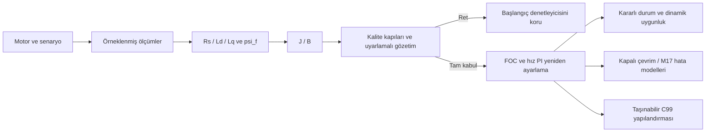

[**Türkçe**](README.md) | [English](README.en.md)

# Self-Commissioning PMSM Drive

## PMSM Sürücü Devreye Alma ve Parametre Kestirimi

Simüle edilen gerilim, akım ve hız ölçümlerinden `Rs, Ld, Lq, psi_f, J, B`
kestirimi yapar. Kalite kontrolleri sağlanırsa akım ve hız PI denetleyicilerini
yeniden ayarlar; çalışma noktasını ve kapalı çevrim yanıtını inceler. Ret durumunda
başlangıç parametreleri korunur, firmware dışa aktarımı kapatılır.

PySide6/Qt ile bağımsız masaüstü uygulamasıdır; tarayıcı veya yerel web sunucusu
gerekmez. v1.0 mühendislik altyapısı korunmuştur; v1.1.0 Türkçe/English arayüz
ve Windows x64 dağıtımıyla yayımlanmıştır.


## Çalıştırma

### 1 — Windows paketi

Windows x64 için hedef dosya:
**`PMSM-Commissioning-Workbench-v1.1.0-Windows-x64.zip`**.

1. [v1.1.0 sürüm sayfasından](https://github.com/terogra/self-commissioning-pmsm-drive/releases/tag/v1.1.0)
   Windows ZIP ve `SHA256SUMS.txt` dosyalarını indirin. Doğrulanmış CI çıktıları
   ayrıca [Windows derleme iş akışında](https://github.com/terogra/self-commissioning-pmsm-drive/actions/workflows/windows-portable.yml)
   saklanır.
2. ZIP'in **tamamını** çıkartın; `_internal` klasörünü koruyun.
3. **`PMSM-Commissioning-Workbench.exe`** dosyasına çift tıklayın. Uygulama
   bağımsız bir masaüstü penceresinde açılır; tarayıcı veya yerel web sunucusu
   gerekmez. Python, pip veya Git gerekmez; konsol açılmaz.
4. Bitirmek için uygulama penceresini kapatın. Çalışan devreye alma işleminin
   tamamlanmasını bekleyin.

**EXE imzasızdır.** Windows SmartScreen uyarabilir. SHA-256 dosya bütünlüğünü
kontrol eder; kod imzası veya güvenlik garantisi değildir. İmzasız ikili
çalıştırmak istemiyorsanız kaynak yolunu kullanın. EXE zorunlu değildir.
[Windows başlangıç ve hata giderme](packaging/README_WINDOWS_TR.md).

### 2 — Kaynak kod

Python **3.11 veya 3.12** ile Windows PowerShell'de:

```powershell
git clone https://github.com/terogra/self-commissioning-pmsm-drive.git
cd self-commissioning-pmsm-drive
python -m venv .venv
.\.venv\Scripts\Activate.ps1
python -m pip install -r requirements.txt
python -m app
```

Etkinleştirme betiği engellenirse ortamı etkinleştirmeden
`.\.venv\Scripts\python.exe -m pip install -r requirements.txt` ve
`.\.venv\Scripts\python.exe -m app` kullanılabilir.
Linux/macOS'ta etkinleştirme komutu `source .venv/bin/activate` olur.
Git olmadan kaynak ZIP'i indirmek de mümkündür.

Arayüz varsayılan olarak Türkçedir; **Dil / Language** ile English seçilebilir.
Dil değişimi parametreleri veya hesaplanmış sonucu değiştirmez.
**Devreye Almayı Başlat** yeni hesaplama yapar; sekme veya dil değişimi yapmaz.
Hesaplama arka plan iş parçacığında çalışır; aynı anda ikinci işlem başlatılmaz.
Grafikler ve kayıt tabloları Qt penceresindedir. Dışa aktarımda yerel dosya
kaydetme iletişim kutusu kullanılır.

Varsayılan görünümde kutup çifti, DC bara, hız/yük isteği, akım sınırı,
devreye alma yöntemi, tohum ve M17 senaryosu seçilir. **Başlangıç modeli:
Varsayılan** mevcut başlangıç kabullerini kullanır; altı motor parametresini
girmeniz gerekmez. `Rs, Ld, Lq, psi_f, J, B` ölçümlerden kestirilir.
**Özel** seçimi başlangıç/yedek model alanlarını açar. Sanal motorun gerçek
değerleri, uyartım/gürültü ve doğrulama zamanlaması **Gelişmiş Simülasyon
Ayarları** içinde varsayılan olarak gizlidir. Bu motor değerleri yalnızca
sanal motoru oluşturur; kestiriciye verilmez. Sonuçlarda başlangıç kabulleri,
kestirimler ve etkin denetleyici ayrı gösterilir; gerçek değerler **Doğrulama**
alanındadır.

## Devreye alma akışı



Aşama kestirimleri, ölçüm/model grafikleri, model artığı ve duyarlılık tanıları, ret
nedenleri, yeniden deneme geçmişi, kazançlar ve akım/gerilim sınırları incelenebilir.
Gerçek simülasyon değerleri ayrı **Doğrulama**
bölümündedir; kestirici veya kalite kapısı bunlara erişmez. İç tanı kodları
ve JSON anahtarları iki dilde de tekrarlanabilirlik için sabittir.

## Doğrulama

- dq PMSM modeli, Clarke/Park, akım FOC ve kademeli hız PI; DC bara doyumu ve anti-windup.
- Ölçümlerle `Rs, Ld, Lq, psi_f, J, B` kestirimi, ölçüm tabanlı kalite kapıları ve sınırlandırılmış uyarlamalı denemeler.
- Ayrı geliştirme/değerlendirme popülasyonları, başarısız ve bias içeren kabul örnekleri; M17 ölçüm/inverter/gecikme/bara/Rs hata modelleri.
- Kararlı v1.0: **265 test**, **43 yerel C doğrulaması**, **31.484 Python/C örneği**; **16 doyum sınırı farkı** kanıtta korunur.
- v1.1 CI: Python 3.11/3.12, GCC/Clang, gerçek Qt pencere oluşturma, dil değişimi,
  kabul/ret ve dışa aktarım. Paketlenmiş EXE ve boşluk içeren yola çıkartılan ZIP
  Qt offscreen ortamında sınanır; SHA-256 üretilir. HTTP hazır olma testi kullanılmaz.

[Doğrulama ayrıntıları](docs/v1_validation.md) · [v1.1 ürünleştirme](docs/v1_1_productization.md) ·
[Masaüstü mimarisi](docs/desktop_architecture.md) · [v1.0 mimari kaydı](docs/architecture.md) · [Mühendislik günlüğü](docs/engineering_log.md).
[Arayüz terminolojisi](docs/terminology.md).

Tarayıcısız gerçek gösterim:

```sh
python -m experiments.v1_demo --output demo-current
python -m pytest -q
```

Bir kabul ve bir açık ret durumu hesaplanır. Depodaki v1.0 kanıtı yeniden
etiketlenmez veya üzerine yazılmaz; yeni çalışmanın sürüm bilgisi ayrıdır.
[v1.0 teknik başvuru ve deney komutları](README.v1.0.md).

Eski Streamlit arayüzü yalnızca geliştirme için tutulur: `python -m pip install
-r requirements-legacy.txt`, ardından `python -m app.legacy`. Windows masaüstü
ürününe dahil edilmez; ana kullanım yolu değildir.

## Varsayımlar ve sınırlar

Bu bir **simülasyon çalışmasıdır**. Bilinen kutup çifti sayısı ve mekanik devreye
almada bilinen sıfır dış yük varsayılır. Bilinmeyen yük, Coulomb/statik sürtünme,
eklenen atalet ve sensör bias/ofset hatası kapsamı sınırlar. İyi hız izleme tek başına
doğru devreye almayı kanıtlamaz. Kalite kabulü her çalışma isteğinin uygun
olduğunu göstermez.

Yarı kararlı durum süre kestirimi evrensel bir fiziksel alt sınır değildir; tam dq
geçici rejimi hız bandına daha erken girebilir. Korunan teknik ifade:
the quasi-steady estimate is **not a physical minimum or universal lower bound**;
the **full dq transient simulation** can enter the band earlier.

C99 yapılandırması **firmware'e hazırdır**, MCU'ya yüklenmiş firmware değildir.
STM32 dağıtımı, hedef zamanlaması, donanım doğrulaması, MISRA uygunluğu veya
fiziksel güvenlik garantisi iddia edilmez. Windows paketi yerel ve imzasızdır.

## Lisans ve sürüm

Kaynak kod [MIT lisanslıdır](LICENSE); bağımlılıkların kendi lisansları geçerlidir.
[Değişiklik günlüğü](CHANGELOG.md) · [v1.1 sürüm notları](RELEASE_NOTES_v1.1.0.md).
