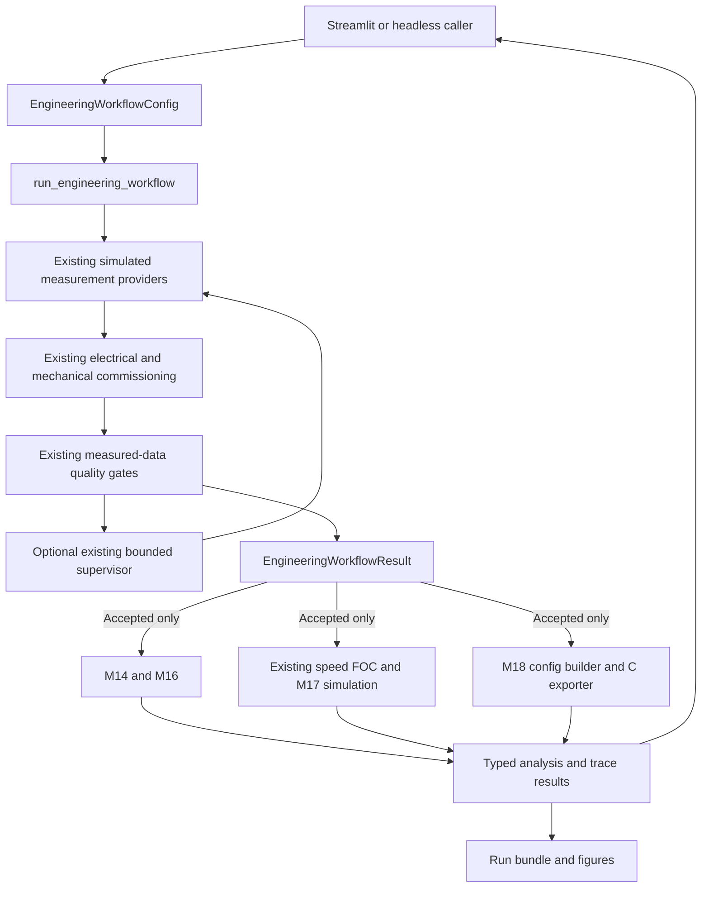

# v1 engineering application architecture

Version **1.0.0**, release candidate. M19 integrates M1-M18 without changing
their equations, thresholds, adaptive actions or numerical parity budgets.

## Entry points and ownership

| Layer | Modules | Responsibility |
| --- | --- | --- |
| Local launch | `app/__main__.py` | Launch the installed Streamlit on loopback using the current Python interpreter |
| Dashboard | `app/dashboard.py` | Configure, submit once, inspect, download; retain the last completed run in session state |
| Presentation | `app/presentation.py` | Read-only units/tables and explicitly versioned M18 evidence |
| Orchestration | `src/engineering_workflow.py` | Typed input/result, real measurement providers, existing commissioning, retuning and downstream analyses |
| Figures | `src/engineering_reporting.py` | Plot measured fits and actual simulated control signals |
| Bundle | `src/engineering_bundle.py` | JSON, sampled CSV, PNG, accepted M18 header and ZIP |
| Demonstration | `experiments/v1_demo.py` | Two predeclared cases through the same backend |
| Version | `src/version.py` | Single project version and release-candidate status |

## Input and result contract

`EngineeringWorkflowConfig` explicitly separates `simulation_truth` from
`prior_assumptions`. It includes seed, exact M17 preset/exposure, one-shot or
adaptive mode, operating request, timing and existing excitation configurations.
The provider configurations are resolved to seed / seed+1 / seed+2 and selected
DC bus before being stored in the result. The UI uses these recorded inputs,
not the currently edited controls, to describe a completed run.

`EngineeringWorkflowResult` is a frozen, clearly defined snapshot containing:

- Resolved configuration, version/repository/time metadata and exact nonidealities.
- Full commissioning if available, overall quality and every attempt.
- Measurement records, including provider failures and noise/configuration metadata.
- Supervisor state, actions and next retry configuration when adaptive mode is used.
- Active motor parameters and constants inspected from existing controller constructors.
- Optional steady, dynamic, control and firmware results, plus explicit warnings.
- A separately named `SimulationEvaluation` for hidden truth and post-hoc errors.

Trace arrays and their mapping are read-only. Existing nested diagnostic objects
retain their original backend types; this is not a new serialization schema for
the research estimators. Bundle JSON has schema `pmsm-engineering-run-v1`.

## Real backend calls

| Stage | Existing API used |
| --- | --- |
| Locked rotor | `simulate_locked_rotor_measurements` |
| Driven rotor | `simulate_driven_rotor_measurements` |
| Free rotor, known zero external load | `simulate_mechanical_measurements(...).measurements` |
| One-shot electrical/full identification | `commission_from_measurements`, `complete_commissioning` |
| Adaptive | `run_adaptive_commissioning` and its existing policy/attempt records |
| Controller update | `FullCommissioningResult.retuned_controller_parameters` |
| Gain display | `CurrentFOCController`, `SpeedController` |
| Steady request | `assess_operating_point` |
| Dynamic request | `assess_dynamic_operating_point` |
| Actual validation | `run_speed_foc_simulation` with hidden plant, accepted commissioning and M17 errors |
| Metrics / scenario registry | Existing `operation_metrics` / `scenarios` from the M17 experiment |
| Firmware | `build_firmware_config`, `export_c_header` |

The adapter deliberately reuses M17's exact registry and metric function rather
than defining competing presets or metric equations. Private supervisor helpers
are reused only to present the same one-shot stage checks/diagnostic snapshots;
their policy is unchanged. This dependency should be reviewed if those existing
APIs are refactored later.

## Information boundaries

Hidden truth is confined to simulation providers, actual plant validation and
post-hoc evaluation. Estimators receive sampled measurements; mechanical torque
uses commissioned electrical estimates, measured currents and known pole pairs.
No true Rs/Ld/Lq/psi/J/B, hidden torque or downstream control outcome reaches a
gate or retry decision. Simulation-error configuration is explicitly configured
experiment metadata, not an estimator's source of truth parameters.

On rejection the active parameters remain the entire prior configuration.
Partial fits and rejected attempts remain inspectable. Commissioned operating
analysis and firmware output are absent. The export boundary independently
rechecks acceptance; an old header/control CSV is removed when a managed output
directory is reused for rejection. Starting a new UI run clears stale results,
header and bundle, including when input validation fails.

On acceptance, identification quality and operating feasibility remain separate.
A voltage-infeasible target can retain accepted commissioning and an available
motor configuration while M14/M16/control validation report their adverse
outcomes. A downstream numerical/configuration failure produces an unavailable
section and warning, not a fabricated result or changed identification gate.

## Prediction versus evaluation

M14/M16 use the identified model. M16 includes its quasi-steady estimate and
controller-aware ideal-model prediction. Its quasi-steady time is **not a
universal physical minimum**. M16 uses constant load from time zero; the actual
validation uses the configured load step. M17 operation errors affect the
actual validation, not a secretly modified M16 predictor. The dashboard exposes
these assumptions and preserves all returned reason strings.

Actual current/torque/bus truth, percentage errors and true-frame metrics appear
under **Simulation evaluation / ground truth**. Terminal voltage after M17
errors is distinct from the controller's nominal-bus limited command. The
unchanged anti-windup does not receive an extra hidden terminal correction.

## Reproduction and deployment boundary

Seed/configuration determine computations. UTC timestamp, Git revision and
dirty state are provenance only. The bundle writes full numerical summaries,
all attempts and a compact trace: every 25th sample, final sample and both
saturation-transition sets. Full-trace metrics are never calculated from this
downsampled CSV. Nonfinite diagnostic values serialize as JSON null with an
explicit explanation. Historical M1-M18 result directories cannot be overwritten
by the bundle API.

M18 parity is a committed, hashed validation artifact, not replayed on every
interaction. The app computes its current header via M18, but makes no current
run Python/C parity claim. Portable C control remains host-verified; there is no
MCU deployment, target timing, hardware safety certification or MISRA claim.
Streamlit is a synchronous local engineering tool, not a real-time drive server.
