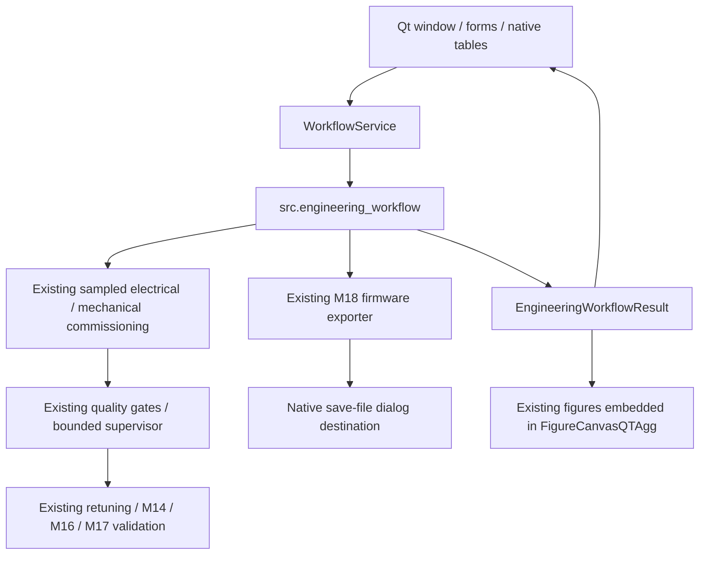

# Native desktop architecture — v1.1.0 candidate

The product is a PySide6/Qt Windows desktop, launched with `python -m app`
or `PMSM-Commissioning-Workbench.exe`. It has no web server, browser view or
HTML UI. `app.dashboard` is retained only for optional legacy development.
The [v1.0 architecture](architecture.md) remains historical evidence.

## Boundaries

- `src/`, `experiments/`, `firmware/`, historical `results/` and engineering
  protocols remain unchanged. The 74-file hash contract is retained.
- `desktop.services` creates typed input configuration and delegates execution,
  firmware and bundle exports to existing APIs. It contains no estimators,
  gate thresholds, gain formulas or feasibility decisions.
- `desktop.configuration` uses backend defaults and stores combo codes in Qt
  item data. Simulation truth lives inside a collapsed advanced group. The
  default prior is read from `EngineeringWorkflowConfig().prior_assumptions`;
  an explicit Custom selection reveals editable fallback assumptions. Switching
  back to Default retains custom widget edits but ignores them for the run.
  Language changes preserve the collapse/selection states. The field ranges
  follow the legacy UI; unbounded fields use finite Qt input ranges only.
- `desktop.worker` runs the synchronous API in a `QThread`. The GUI disables
  inputs/run/export during work, blocks overlap and declines close until the
  active worker finishes. There is no cancellation claim. Only GUI-thread slots
  construct widgets/figures. Failures restore controls and log detailed errors.
- `desktop.main_window` displays the returned quality, attempts, values and
  operating analysis. Rejected fits remain estimates; active controller values
  are the retained prior. Export enablement reads `firmware_available`; the
  existing exporter rechecks acceptance at its boundary.
- `desktop.tables` keeps unrounded values under Qt's `UserRole`; precision is
  display-only. Reason codes and JSON keys remain exact.
- `desktop.plots` embeds existing figure factories and changes text labels only.
  Numerical artists and result arrays are not altered.
- `app.localization` and `app.presentation` are shared pure presentation modules.
  They do not import Streamlit. Language changes rebuild only the results view;
  inputs, result identity, selected scenario and export state are retained.

## Runtime and distribution

One `QApplication` owns one `MainWindow`. Qt 6 supplies DPI-aware widgets,
resizable split panels and scroll areas. Native file dialogs select export
destinations. No existing project icon is available, so no new decorative icon
is invented. The application uses ordinary Qt styling.

The PyInstaller onedir build uses `console=False` and the Windows GUI subsystem.
It packages required PySide6 plugins, Matplotlib Agg/QtAgg assets and the
versioned M18 parity JSON. Resource paths derive from `__file__`, independent of
cwd. Version is still `1.1.0`, release candidate; no tag/release is created.

`requirements.txt` contains the desktop dependencies and pytest.
`packaging/requirements-windows.txt` pins the native build inputs; Streamlit is
absent. `requirements-legacy.txt` adds the optional development web UI.
`app.__main__` delegates directly to the native entry, as does the internal
`desktop` module alias. The web launcher is explicitly `python -m app.legacy`.
Full Python CI retains those legacy UI tests; the native Windows job installs
no Streamlit and skips only its two optional UI tests.

Startup/runtime exceptions are recorded in
`%LOCALAPPDATA%/PMSMCommissioningWorkbench/logs/desktop.log`, with a temporary
directory fallback when the normal log directory cannot be created. End-user
dialogs contain concise errors rather than Python tracebacks.

## Validation boundary

Tests run the real default accepted and `timing_one_sample` rejected workflows,
including the threaded Qt action, not historical CSV playback. They verify
language state, raw table values, plot data, header equality, blocked export,
failure recovery and adaptive records. Engineering tests/tolerances are retained.

The actual built EXE is started from an unrelated cwd with
`QT_QPA_PLATFORM=offscreen`, initializes and shows the same native window, writes
its runtime report and exits cleanly. The smoke driver also checks PE subsystem
2 and no imported Streamlit/web-engine runtime. ZIP creation requires that
native result; the extracted EXE is tested again in a path with spaces.
Offscreen initialization is not a substitute for manual Windows GUI review.
The visible packaged application is inspected separately and the README image
comes from that actual Qt window.

No hardware validation or physical safety guarantees are added. Quality
acceptance does not guarantee unbiased estimates or feasible operation. M16's
quasi-steady estimate remains model-specific, not a universal physical bound.
